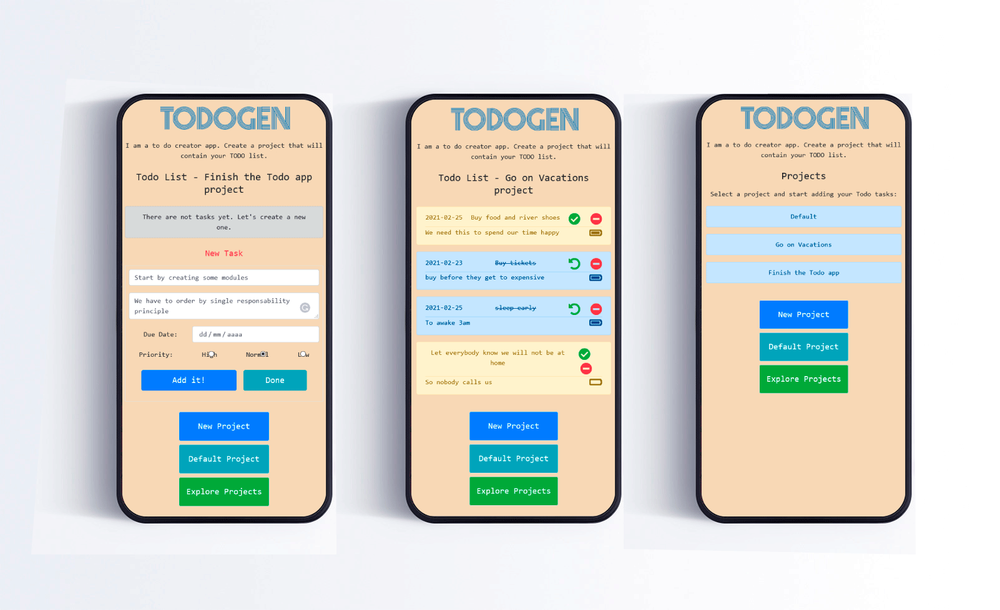

# Todo App

> Main purpose of this project is practicing greatest features of Javascript, such as object constructors, prototypal inheritance and functional programming and modules. The TODO app consist on a utility that let us to create projects and their lists of tasks needed to accomplish such project. I focused in the mobile only approach as for the first version of the app.
> Second purpose is practicing Jest for testing.




## Built With

- HTML5
- Bootstrap 4.6
- Fontawesome 5
- Javascript ES6
- ES6 modules
- Webpack
- localStorage

## Tested with

- Jest
- Playwright

## Live Demo

[Live Demo Link](http://mauriciosantos.paternit.com/io/todo-app/)


## Getting Started

To preview the site:

- Go to live demo Uri
- Use navigation on to to browse the site

To get a local copy up and running follow these simple example steps.

- Clone the repository
- Install node on your computer and ensure that you have node modules
- Install webpack and set it up using this [guide](https://webpack.js.org/guides/asset-management/#setup)
- Test whether it is running well or not

## Dependencies

- Install Webpack:
```
npm install webpack webpack-cli --save-dev
```
- Install Jest (below)
- Install Playwright (below)
## Testing

- install jest suite with this command:
```
npm install --save-dev jest
```
- install playwright with this command:
```
npm i -D playwright
```
After above steps, type in command line: 
```
npm run test
```
## Author

👤 **Mauricio Santos**

- Github: [@maosan132](https://github.com/maosan132)
- Twitter: [@maosan132](https://twitter.com/maosan132)
- Linkedin: [maurisantos](https://www.linkedin.com/in/mauricsantos)


## 🤝 Contributing

Contributions, issues, and feature requests are welcome!

## Show your support

Give a ⭐️ if you like this project!

## Acknowledgments

- Hat tip to anyone whose code was used
- Inspiration
- etc

## 📝 License

This project is [MIT](lic.url) licensed.
